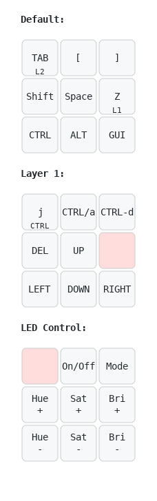

# Affinity/Adobe Keymap

This keymap that contains useful keys when using Adobe/Serif tools, more functions can be added with [layers](https://thomasbaart.nl/2018/12/06/qmk-basics-how-to-add-a-layer-to-your-keymap/).
## Keys

The keys are split into three layers, which makes the 9 keys have **26** different commands. The Top layer is the default one. These are the ones you will use for commonly-used modifiers. The second layer controls other commands and cursor keys. The third layer controls the keyboard's lights.

L1 = Hold for Layer 1

L2 = Hold for Keyboard Light Controls

 # How to adjust
 
  1) Go to [vial.rocks](https://vial.rocks) in a browser
  2) Tune keys/lighting until it fits your workflow
  8) Enjoy your VEEBKEEB
